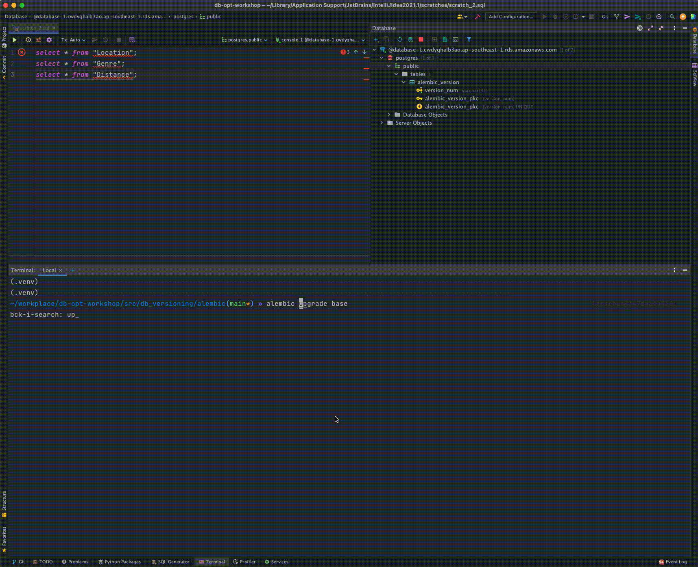

## Demo



## Switch rds endpoint

```
cp alembic.sample.ini alembic.ini

# Update
sqlalchemy.url = postgresql://<username>:<password>@<hostname>

```

## To add a new revision

```
alembic revision -m "Add a column" 
```

## To upgrade the migration

```
# To latest
> alembic upgrade head

# Upgrade n version  
> alembic upgrade +1 
```

## To downgrade the migration

```
# Downgrade to base
> alembic downgrade base

# Downgrade n version 
alembic downgrade -1 
```

## To see history of migration 

```
> alembic history --verbose 
```

## To view current migration

```
> alembic current
```